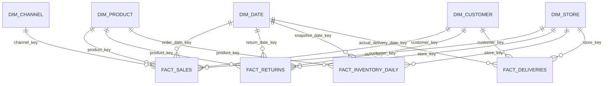

# RetailPulse 360 — Modèle dimensionnel

## 1. Objectif

Le Data Warehouse RetailPulse 360 utilise une modélisation en étoile.

Cette architecture sépare :

- les tables de faits contenant les événements et les mesures ;
- les dimensions contenant les axes d'analyse.

Les utilisateurs pourront analyser les ventes, retours, stocks et livraisons selon :

- la date ;
- le client ;
- le produit ;
- le magasin ;
- le canal de vente.

## 2. Table fact_sales

Granularité :

```text
Une ligne par article vendu dans une commande
```

Clé métier :

```text
order_id + order_item_id
```

Clés étrangères :

- order_date_key ;
- customer_key ;
- product_key ;
- store_key ;
- channel_key.

Dimensions dégénérées :

- order_id ;
- order_item_id.

Mesures :

- quantity ;
- unit_price ;
- unit_cost ;
- gross_sales ;
- discount_amount ;
- sales_after_discount ;
- returned_quantity ;
- refunded_amount ;
- net_revenue ;
- net_cogs ;
- gross_margin ;
- gross_margin_rate.

## 3. Table fact_returns

Granularité :

```text
Une ligne par événement de retour
```

Clé métier :

```text
return_id
```

Clés étrangères :

- return_date_key ;
- customer_key ;
- product_key ;
- store_key.

Mesures :

- returned_quantity ;
- refund_amount ;
- days_before_return.

Dimensions dégénérées :

- return_id ;
- order_id ;
- order_item_id.

## 4. Table fact_inventory_daily

Granularité :

```text
Une ligne par date, magasin et produit
```

Clé métier :

```text
snapshot_date + store_id + product_id
```

Clés étrangères :

- snapshot_date_key ;
- product_key ;
- store_key.

Mesures :

- available_quantity ;
- reserved_quantity ;
- damaged_quantity ;
- reorder_threshold ;
- is_out_of_stock ;
- is_below_reorder_threshold.

## 5. Table fact_deliveries

Granularité :

```text
Une ligne par commande livrée
```

Clé métier :

```text
delivery_id
```

Clés étrangères :

- shipping_date_key ;
- expected_delivery_date_key ;
- actual_delivery_date_key ;
- customer_key ;
- store_key.

Mesures :

- delivery_duration_days ;
- delay_days ;
- is_delivered_on_time.

Dimensions dégénérées :

- delivery_id ;
- order_id.

## 6. Dimension dim_date

La dimension date permet d'analyser les événements dans le temps.

Colonnes :

- date_key ;
- full_date ;
- day ;
- day_name ;
- week_number ;
- month ;
- month_name ;
- quarter ;
- year ;
- is_weekend.

La clé `date_key` utilise le format :

```text
YYYYMMDD
```

Exemple :

```text
20260806
```

## 7. Dimension dim_customer

Type :

```text
Slowly Changing Dimension Type 2
```

Colonnes :

- customer_key ;
- customer_id ;
- customer_hash ;
- city ;
- country ;
- customer_segment ;
- valid_from ;
- valid_to ;
- is_current.

Lorsqu'un client change de ville ou de segment :

1. l'ancienne version reçoit une date de fin ;
2. `is_current` devient false ;
3. une nouvelle version du client est créée ;
4. la nouvelle version possède `is_current = true`.

Les informations personnelles directes ne seront pas exposées dans cette dimension.

## 8. Dimension dim_product

Type :

```text
Slowly Changing Dimension Type 2
```

Colonnes :

- product_key ;
- product_id ;
- product_name ;
- category ;
- subcategory ;
- brand ;
- standard_price ;
- standard_cost ;
- active ;
- valid_from ;
- valid_to ;
- is_current.

Cette dimension permet de conserver l'historique des changements de :

- catégorie ;
- sous-catégorie ;
- marque ;
- prix standard ;
- coût standard ;
- statut actif.

## 9. Dimension dim_store

Colonnes :

- store_key ;
- store_id ;
- store_name ;
- city ;
- region ;
- opening_date ;
- active.

## 10. Dimension dim_channel

Colonnes :

- channel_key ;
- channel_code ;
- channel_name.

Valeurs autorisées :

- WEB ;
- MOBILE ;
- STORE ;
- CALL_CENTER.

## 11. Relations principales



## 12. Schémas Snowflake

Le Data Warehouse utilisera les schémas suivants :

```text
RAW
STAGING
INTERMEDIATE
ANALYTICS
AUDIT
```

### RAW

Contient les données proches de leur format source.

Aucune logique métier importante ne doit être appliquée dans ce schéma.

### STAGING

Contient les données :

- renommées ;
- typées ;
- nettoyées ;
- standardisées ;
- dédupliquées.

### INTERMEDIATE

Contient les modèles réutilisables nécessaires aux transformations complexes :

- jointures ;
- agrégations intermédiaires ;
- calculs métier ;
- préparation des dimensions et faits.

### ANALYTICS

Contient les tables finales :

- dim_date ;
- dim_customer ;
- dim_product ;
- dim_store ;
- dim_channel ;
- fact_sales ;
- fact_returns ;
- fact_inventory_daily ;
- fact_deliveries.

Ces tables seront utilisées par Power BI.

### AUDIT

Contient :

- les métadonnées d'exécution ;
- les résultats des tests ;
- les erreurs ;
- le nombre de lignes traitées ;
- les fichiers déjà chargés ;
- les dates de début et de fin des pipelines.

## 13. Avantages du modèle en étoile

Le modèle en étoile permet :

- de simplifier les requêtes analytiques ;
- de faciliter la compréhension métier ;
- d'améliorer l'utilisation dans Power BI ;
- de séparer les mesures et les axes d'analyse ;
- de conserver l'historique avec les dimensions SCD Type 2 ;
- d'obtenir des KPI cohérents et réutilisables.
