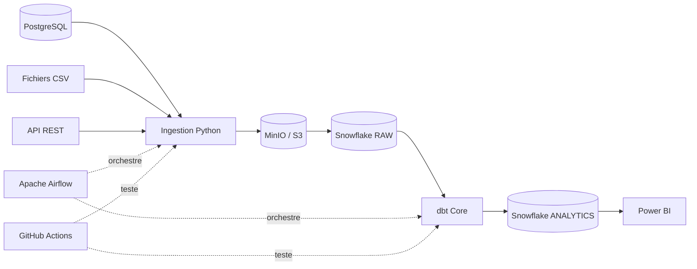

# ADR-001 — Choix d'une architecture ELT

## Statut

Accepté.

## Contexte

RetailPulse 360 collecte des données depuis :

- PostgreSQL ;
- des fichiers CSV ;
- une API REST.

Le projet doit construire un Data Warehouse moderne avec Snowflake, dbt et Apache Airflow.

## Décision

L'architecture retenue est une architecture ELT.

Les étapes sont :

1. extraire les données depuis les sources ;
2. conserver les données brutes dans MinIO ou S3 ;
3. charger les données dans Snowflake ;
4. transformer les données dans Snowflake avec dbt ;
5. orchestrer les traitements avec Airflow ;
6. exposer les données analytiques à Power BI.

## Architecture cible

## Raisons du choix ELT

- Snowflake possède la puissance nécessaire pour transformer les données ;
- dbt permet d'écrire des transformations SQL modulaires ;
- les données brutes restent disponibles ;
- les transformations peuvent être rejouées ;
- les tests peuvent être automatisés ;
- la logique métier est versionnée dans Git ;
- les tables finales sont adaptées à Power BI.

## Alternatives rejetées

### Transformation complète en Python avant Snowflake

Cette approche rendrait les transformations métier moins accessibles aux profils SQL.

### Chargement direct dans les tables finales

Cette solution réduirait la traçabilité et rendrait les reprises après panne difficiles.

### Ajout de Databricks dans ce projet

Databricks sera utilisé dans un autre projet consacré au Lakehouse et à PySpark.

Cela évite d'empiler des technologies sans justification métier.
